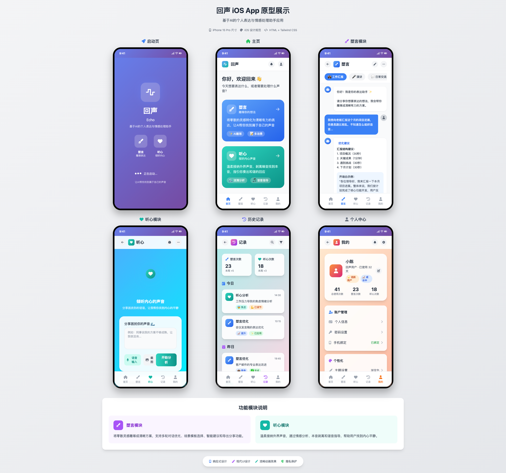

# 回声 (Echo) 📱

> 基于AI的个人表达与情感处理助手应用

## 项目简介 🎯

回声是一款专为提升个人表达能力和情感处理能力而设计的iOS应用。通过AI技术，帮助用户将零散的想法雕琢成清晰的表达，同时温柔地处理外界声音，找到内心的平衡与和谐。

## 应用截图 📸



*展示了回声App的完整界面设计，包括启动页、主页、塑言模块、听心模块、历史记录和个人中心等核心页面*

## 核心功能 ✨

### 🎨 塑言模块
- **灵感整理**：将零散想法转化为逻辑清晰的方案
- **AI雕琢**：多种表达风格和语调选择
- **智能优化**：提供不同场景的表达模板
- **历史记录**：保存想法演进过程

### 🌊 听心模块
- **情感分析**：深度解析外界声音的情感色彩
- **本音剥离**：从复杂信息中提取核心事实
- **和谐回应**：个性化回应策略推荐
- **涟漪动效**：直观展示内心波澜变化

## 技术特性 🛠️

- **现代iOS设计**：采用最新iOS设计规范，支持深色模式
- **流畅动画**：精心设计的过渡动画和交互效果
- **AI集成**：支持主流大模型API接入
- **数据安全**：本地加密存储，保护用户隐私
- **响应式布局**：适配不同尺寸的iPhone设备

## 页面结构 📄

```
├── launch.html      # 启动页 - 品牌展示
├── home.html        # 主页 - 功能导航
├── expression.html  # 塑言模块 - 想法雕琢
├── listening.html   # 听心模块 - 声音处理
├── history.html     # 历史记录 - 使用轨迹
├── profile.html     # 个人中心 - 设置管理
└── index.html       # 演示页面 - 项目展示
```

## 设计亮点 🎨

### 视觉设计
- **色彩方案**：柔和的蓝绿色调，营造平静氛围
- **字体系统**：San Francisco字体，确保最佳可读性
- **图标设计**：SF Symbols图标系统，保持一致性
- **动效设计**：流动的涟漪效果，体现「回声」概念

### 交互体验
- **底部导航**：固定式导航栏，快速切换功能
- **手势操作**：支持滑动、点击等自然手势
- **反馈机制**：即时的视觉和触觉反馈
- **加载状态**：优雅的加载动画，提升等待体验

## 快速开始 🚀

### 在线预览
访问 [GitHub Pages](https://xiaoweiruby.github.io/echo-app/) 查看在线演示

### 本地运行
```bash
# 克隆项目
git clone git@github.com:xiaoweiruby/echo-app.git

# 进入项目目录
cd echo-app

# 启动本地服务器
python3 -m http.server 8000

# 访问 http://localhost:8000
```

## 项目结构 📁

```
echo-app/
├── README.md           # 项目说明文档
├── index.html          # 项目演示页面
├── launch.html         # 启动页面
├── home.html           # 应用主页
├── expression.html     # 塑言功能页
├── listening.html      # 听心功能页
├── history.html        # 历史记录页
├── profile.html        # 个人中心页
└── 需求梳理文档.md      # 详细需求文档
```

## 开发规范 📋

### Git提交规范
遵循 [Conventional Commits](https://www.conventionalcommits.org/) 规范：
- `feat`: 新功能
- `fix`: 修复问题
- `docs`: 文档更新
- `style`: 代码格式
- `refactor`: 重构代码
- `test`: 测试相关
- `chore`: 构建过程或辅助工具变动

### 分支命名
- `feature/功能名称`: 新功能开发
- `bugfix/问题描述`: 问题修复
- `hotfix/紧急修复`: 紧急修复
- `release/版本号`: 发布准备

## 技术栈 💻

- **前端框架**: HTML5 + CSS3 + JavaScript
- **设计系统**: iOS Human Interface Guidelines
- **动画库**: CSS Animations + Transitions
- **图标系统**: SF Symbols
- **字体**: San Francisco (系统字体)
- **构建工具**: 原生Web技术

## 浏览器支持 🌐

- Safari (iOS 14.0+)
- Chrome (移动端)
- Firefox (移动端)
- Edge (移动端)

## 版本历史 📝

### v1.0.0 (2024-01-XX)
- ✨ 初始版本发布
- 🎨 完整的iOS风格界面设计
- 🔧 塑言和听心核心功能
- 📱 响应式布局适配
- 🎭 底部导航栏实现

## 贡献指南 🤝

1. Fork 本仓库
2. 创建特性分支 (`git checkout -b feature/amazing-feature`)
3. 提交更改 (`git commit -m 'feat: add amazing feature'`)
4. 推送到分支 (`git push origin feature/amazing-feature`)
5. 创建 Pull Request

## 许可证 📄

本项目采用 MIT 许可证 - 查看 [LICENSE](LICENSE) 文件了解详情

## 联系方式 📧

- 项目维护者: [@xiaoweiruby](https://github.com/xiaoweiruby)
- 项目地址: [https://github.com/xiaoweiruby/echo-app](https://github.com/xiaoweiruby/echo-app)
- 在线演示: [https://xiaoweiruby.github.io/echo-app/](https://xiaoweiruby.github.io/echo-app/)

## 致谢 🙏

感谢所有为这个项目贡献想法和代码的开发者们！

---

**回声 - 让每个想法都有清晰的表达，让每个声音都得到温柔的回应** 💙